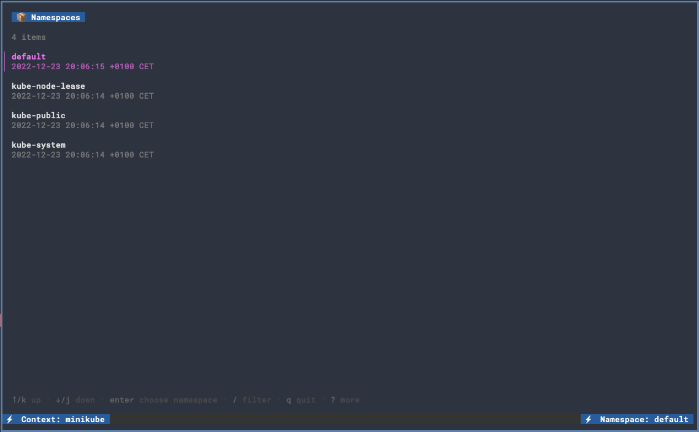

gkns
--------
#### About

The app is a convenient tool for Kubernetes users who need to switch between namespaces frequently. Using the [bubbletea](https://github.com/charmbracelet/bubbletea) library and [client-go](https://github.com/kubernetes/client-go) as a kubernetes client.
With a user-friendly interface that allows users to quickly filter and select the namespace they want to switch to. The app also has a clean and intuitive design, ensuring a smooth and enjoyable user experience.


#### Screenshot



#### Project Layout
```tree
.
├── LICENSE
├── Makefile
├── README.md
├── app
│   ├── client.go
│   ├── config.go
│   └── tui
│       ├── commands.go
│       ├── list.go
│       └── tui.go
├── cmd
│   └── app.go
├── gkns.png
├── go.mod
├── go.sum
├── main.go
└── output
    └── bin
        └── gkns
```

---
#### TODO
- Add tests
- Add more documentations